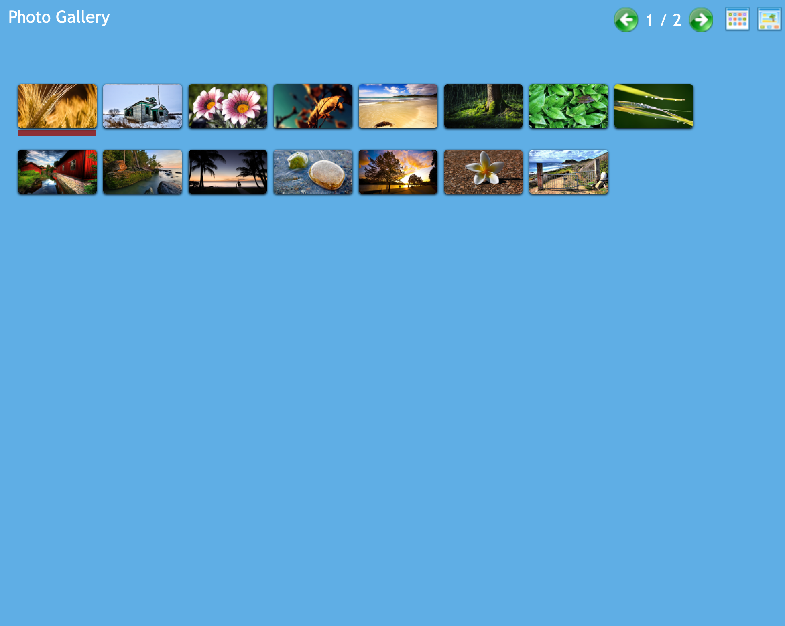

# Gallery

 A photo gallery with an alternate view mode - jQuery Plugin.

 ## Features

1. An alternate view allows users to switch the gallery view mode to either a thumbnail list or a filmstrip view.

1. Users can specify the number of images to be displayed in the thumbnail content.

## Demo

## Filmstrip View Mode

## Grid View Mode

